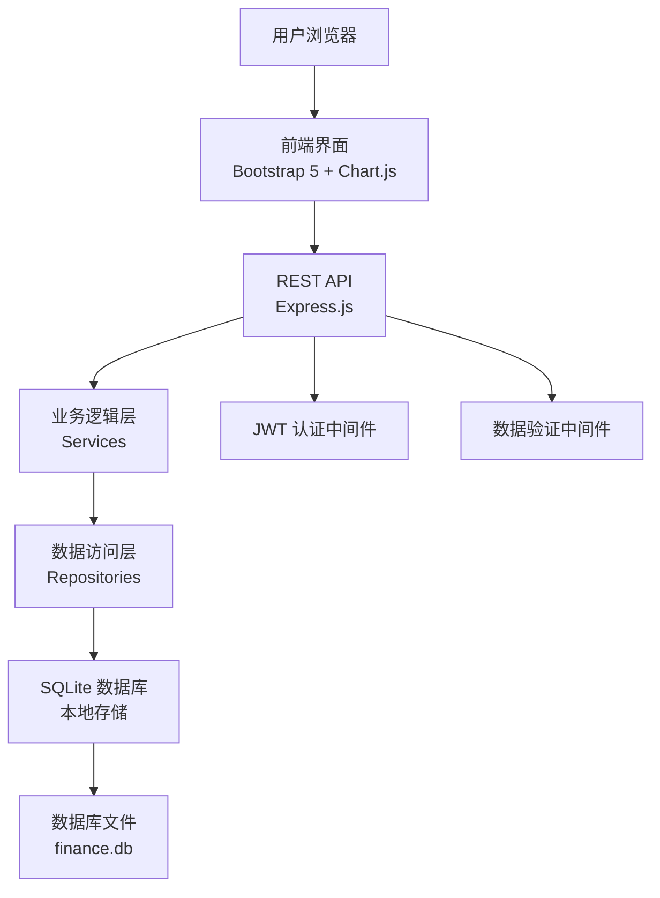

# 财务管理系统 Finance Management System

> **专为计算机知识匮乏人群设计** · 一键启动 · 本地部署 · 数据安全

[](https://nodejs.org/)
[](LICENSE)
[](https://www.microsoft.com/windows)
[]()

一个本地部署的财务管理系统，让您轻松管理个人或家庭财务。无需复杂安装，双击即可使用，所有数据保存在本地，安全私密。

## ✨ 核心特性

### 🚀 一键启动
- **双击运行**：无需安装 Node.js，双击 `start.bat` 即可启动
- **自动打开浏览器**：启动后自动在浏览器中打开财务管理系统
- **智能检测**：自动检测服务器状态，避免重复启动

### 👤 用户友好
- **简单直观界面**：使用 Bootstrap 5 设计，符合常见操作习惯
- **中文界面**：全中文操作，无专业术语困扰
- **逐步引导**：从注册到记账，每一步都有清晰提示

### 💰 财务管理
- **交易记录**：轻松记录每一笔收入和支出
- **分类管理**：自定义收入和支出分类，支持颜色标记
- **数据统计**：自动生成月度收支统计和趋势图表
- **数据分析**：可视化图表展示消费占比和趋势变化

### 🔒 数据安全
- **本地存储**：所有数据保存在本地 `finance.db` 文件中
- **数据备份**：定期自动备份，防止数据丢失
- **多用户支持**：支持家庭成员各自记账，数据隔离

## 🚀 快速开始

### 方法一：一键启动（推荐）
1. 下载本项目到您的 Windows 电脑
2. 双击 `start.bat` 文件
3. 等待浏览器自动打开（约10-30秒）
4. 注册账号，开始记账！

### 方法二：传统安装
```bash
# 1. 克隆仓库
git clone https://github.com/RedHong9/finacial-management.git

# 2. 进入目录
cd finacial-management

# 3. 安装依赖
npm install

# 4. 启动服务器
npm start
# 或者直接运行
start.bat
```

### 系统要求
- **操作系统**：Windows 10 / Windows 11
- **浏览器**：Chrome、Edge、Firefox 等现代浏览器
- **网络环境**：仅本地使用，无需互联网连接

## 📊 功能详解

### 仪表盘
- 实时显示当月收入、支出、结余
- 月度收支对比图表
- 消费分类饼图
- 最近交易记录

### 交易管理
- **添加交易**：快速记录收入或支出
- **编辑交易**：修改交易金额、分类、日期
- **删除交易**：清理不需要的记录
- **批量操作**：支持批量删除和导出

### 分类管理
- 预置常用分类（餐饮、交通、娱乐等）
- 自定义分类名称和颜色
- 分类类型（收入/支出）管理

### 数据分析
- **月度统计**：每月收入支出趋势图
- **分类占比**：各类消费比例分析
- **对比分析**：不同时间段收支对比
- **趋势预测**：基于历史数据的消费趋势

### 系统功能
- **用户注册/登录**：多用户支持，数据隔离
- **数据导出**：支持 Excel、PDF 格式导出
- **服务器关闭**：优雅关闭，数据自动保存
- **健康检查**：系统状态实时监控

## 🏗️ 技术架构



### 技术栈
- **后端**：Node.js + Express.js + SQLite (SQL.js)
- **前端**：原生 JavaScript + Bootstrap 5 + Chart.js
- **认证**：JWT (JSON Web Tokens) + bcryptjs
- **数据库**：SQLite，本地文件存储
- **工具**：npm + Git + Visual Studio Code

### 项目结构
```
finacial-management/
├── public/              # 前端静态文件
│   ├── index.html      # 主页面
│   └── js/app.js       # 前端逻辑
├── src/                # 后端源代码
│   ├── models/         # 数据模型
│   ├── repositories/   # 数据访问层
│   ├── services/       # 业务逻辑层
│   ├── routes/         # API 路由
│   └── middleware/     # 中间件
├── config/             # 配置文件
├── database/           # 数据库文件
├── docs/              # 文档
├── plans/             # 项目计划
├── package.json       # 项目配置
├── server.js          # 服务器入口
└── start.bat          # Windows 启动脚本
```

## 📖 使用指南

### 第一步：启动系统
1. 确保您使用的是 Windows 10 或 Windows 11 系统
2. 找到 `start.bat` 文件，双击运行
3. 等待黑色命令行窗口出现并显示启动信息
4. 浏览器会自动打开，显示登录界面

> **注意**：不要关闭黑色命令行窗口，它是系统运行的基础

### 第二步：注册账号
1. 点击"注册"按钮
2. 输入用户名（建议使用容易记住的名称）
3. 输入密码（至少6位）
4. 点击"注册"完成

### 第三步：开始记账
1. 点击"添加交易"按钮
2. 选择交易类型（收入/支出）
3. 输入金额和说明
4. 选择分类（如餐饮、交通等）
5. 点击"保存"

### 第四步：查看统计
1. 点击"数据分析"菜单
2. 查看月度收支图表
3. 分析消费分类占比
4. 导出数据（如需）

## 🔧 开发指南

### 环境搭建
```bash
# 1. 安装 Node.js (v18+)
# 从 https://nodejs.org/ 下载安装

# 2. 克隆项目
git clone https://github.com/RedHong9/finacial-management.git

# 3. 安装依赖
cd finacial-management
npm install

# 4. 开发模式运行
npm run dev
```

### API 文档
系统提供以下 RESTful API：

#### 认证相关
- `POST /api/auth/register` - 用户注册
- `POST /api/auth/login` - 用户登录
- `POST /api/auth/logout` - 用户登出

#### 交易管理
- `GET /api/transactions` - 获取交易列表
- `POST /api/transactions` - 创建交易
- `PUT /api/transactions/:id` - 更新交易
- `DELETE /api/transactions/:id` - 删除交易

#### 分类管理
- `GET /api/categories` - 获取分类列表
- `POST /api/categories` - 创建分类
- `PUT /api/categories/:id` - 更新分类
- `DELETE /api/categories/:id` - 删除分类

#### 数据分析
- `GET /api/analytics/monthly` - 月度统计
- `GET /api/analytics/category` - 分类占比
- `GET /api/analytics/comparison` - 对比分析
- `GET /api/analytics/trend` - 趋势预测

### 数据库设计
系统使用 SQLite 数据库，包含以下表：

#### users 表（用户信息）
```sql
CREATE TABLE users (
    id INTEGER PRIMARY KEY AUTOINCREMENT,
    username TEXT UNIQUE NOT NULL,
    password_hash TEXT NOT NULL,
    email TEXT,
    role TEXT DEFAULT 'user',
    created_at DATETIME DEFAULT CURRENT_TIMESTAMP
);
```

#### categories 表（分类信息）
```sql
CREATE TABLE categories (
    id INTEGER PRIMARY KEY AUTOINCREMENT,
    name TEXT NOT NULL,
    type TEXT NOT NULL CHECK (type IN ('income', 'expense')),
    user_id INTEGER REFERENCES users(id) ON DELETE CASCADE,
    color TEXT DEFAULT '#007bff',
    UNIQUE(user_id, name)
);
```

#### transactions 表（交易记录）
```sql
CREATE TABLE transactions (
    id INTEGER PRIMARY KEY AUTOINCREMENT,
    user_id INTEGER NOT NULL REFERENCES users(id) ON DELETE CASCADE,
    category_id INTEGER REFERENCES categories(id) ON DELETE SET NULL,
    amount DECIMAL(10,2) NOT NULL,
    description TEXT,
    date DATE NOT NULL,
    created_at DATETIME DEFAULT CURRENT_TIMESTAMP
);
```

## 🤝 贡献指南

我们欢迎任何形式的贡献！请遵循以下步骤：

1. **Fork 仓库**：点击右上角的 Fork 按钮
2. **创建分支**：`git checkout -b feature/your-feature`
3. **提交更改**：`git commit -m 'Add some feature'`
4. **推送分支**：`git push origin feature/your-feature`
5. **创建 Pull Request**

### 开发规范
- 代码风格：遵循 JavaScript Standard Style
- 提交信息：使用清晰的中文或英文描述
- 测试要求：新增功能需包含相应测试
- 文档更新：修改功能需更新相关文档

### 报告问题
如果您发现任何问题，请通过以下方式报告：
1. 查看 [Issues](https://github.com/RedHong9/finacial-management/issues) 是否已有类似问题
2. 创建新 Issue，详细描述问题现象和复现步骤
3. 提供系统环境信息（操作系统、浏览器版本等）

## 📋 版本历史

### v0.1.0-beta (2025-12-27)
- ✅ 基础功能：用户注册/登录、交易管理、分类管理
- ✅ 数据分析：月度统计、分类占比、趋势图表
- ✅ 一键启动：Windows 批处理脚本，自动打开浏览器
- ✅ 数据安全：本地 SQLite 存储，JWT 认证
- ✅ 用户文档：详细的中文使用指南

### 未来计划
- 📅 标签系统：为交易添加多标签支持
- 📅 预算管理：设置月度预算，超支提醒
- 📅 数据同步：多设备间数据同步功能
- 📅 移动端适配：响应式设计，支持手机访问

## 📄 许可证

本项目采用 MIT 许可证 - 查看 [LICENSE](LICENSE) 文件了解详情。

## 🙏 致谢

感谢以下开源项目的支持：
- [Express.js](https://expressjs.com/) - 快速、极简的 Node.js Web 框架
- [Bootstrap 5](https://getbootstrap.com/) - 世界上最流行的前端框架
- [Chart.js](https://www.chartjs.org/) - 简单灵活的 JavaScript 图表库
- [SQL.js](https://sql.js.org/) - SQLite 的 JavaScript 实现

## 📞 支持与联系

如果您遇到问题或有建议：

1. **查看文档**：首先查看 `docs/` 目录下的详细文档
2. **检查 Issues**：查看是否已有类似问题和解决方案
3. **创建 Issue**：在 GitHub 仓库创建新 Issue
4. **邮件联系**：通过 GitHub 个人资料页联系

---

**祝您使用愉快！如果这个项目对您有帮助，请给个 ⭐ Star 支持！**

> 最后更新：2026年1月2日  
> 项目维护者：[RedHong9](https://github.com/RedHong9)