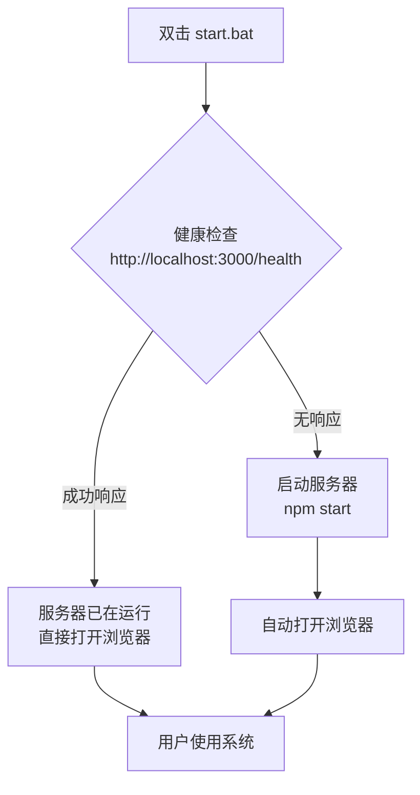

# Start.bat 改进方案

## 问题分析
1. 当前start.bat需要用户交互选择是否自动打开浏览器
2. 端口占用时需要用户决策（Y/N）
3. 不符合"计算机知识极其匮乏人群"的用户画像
4. 不符合一键启动的要求

## 用户要求
1. 点击start.bat自动启动服务器并跳转浏览器前端
2. 服务器在线状态下自动跳转前端
3. 无用户交互，完全自动化
4. 保持代码简洁，减少臃肿

## 简化方案
基于用户反馈"目标用户的环境一般不会运行其它程序"，采用简化策略：

### 核心逻辑


### 具体修改

#### 1. 添加健康检查端点（server.js）
在现有路由后添加：
```javascript
// 健康检查端点
app.get('/health', (req, res) => {
  res.json({ 
    status: 'ok', 
    timestamp: new Date().toISOString(),
    service: 'finance-management-system'
  });
});
```

#### 2. 重写 start.bat
移除：
- 所有 `set /p` 用户输入
- 端口占用检测和交互
- 浏览器选择交互

添加：
- 健康检查逻辑（使用 PowerShell 或 curl）
- 智能决策：
  1. 如果服务器已运行 → 直接打开浏览器
  2. 如果服务器未运行 → 启动服务器
- 简洁的错误处理

#### 3. 保持的环境变量
保留 `OPEN_BROWSER=true` 环境变量，确保自动打开浏览器

## 优先级
1. **高优先级**：实现健康检查和自动化启动
2. **中优先级**：移除用户交互，简化代码
3. **低优先级**：优化错误提示文案

## 测试要点
1. 服务器未运行状态下启动
2. 服务器已运行状态下启动
3. 端口被占用时的错误处理（简化版）

## 可维护性考虑
1. 代码注释充分
2. 保留原有备份文件（start.bat.bak）
3. 修改记录在版本控制中

---
